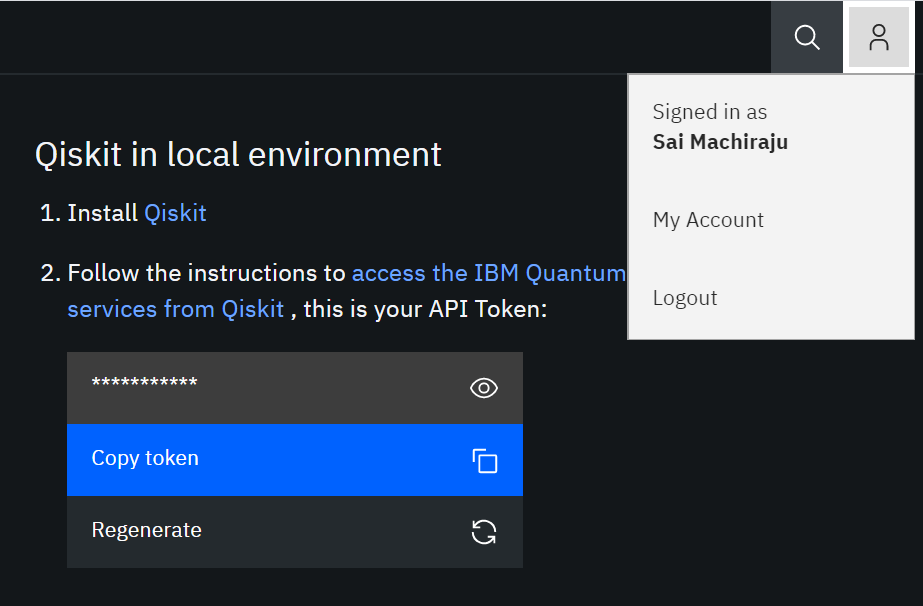

# Quantum Computing with Python

Using existing frameworks/APIs (IBM Qiskit) and writing our own Python code to explore quantum computing. 

## Repository Structure:
notes/--as the name implies, this directory will contain my notes, formatted as YAML and PDF documents \
src/--root directory for code

## Additional Notes
As code is written, installation instructions will be added here. Python is required (>= 3.5), though additional components, including MS VC++, may be needed for Windows.

## Getting Started
1. Create and activate a virtual environment. If you are unfamiliar with this process, please [click here.](https://packaging.python.org/guides/installing-using-pip-and-virtual-environments/)

2. Issue *pip install qiskit*.

3. Sign up for an **IBM Quantum Experience** account [here.](https://quantum-computing.ibm.com/) I could authenticate with the service using my GitHub account.

4. Navigate to *My Account* and under *Qiskit in local environment*, select *Copy token*.

5. Run *src/qiskit/account-setup.py* with the flag *-k [TOKEN COPIED FROM WEBSITE]*. This will save your credentials to disk.
